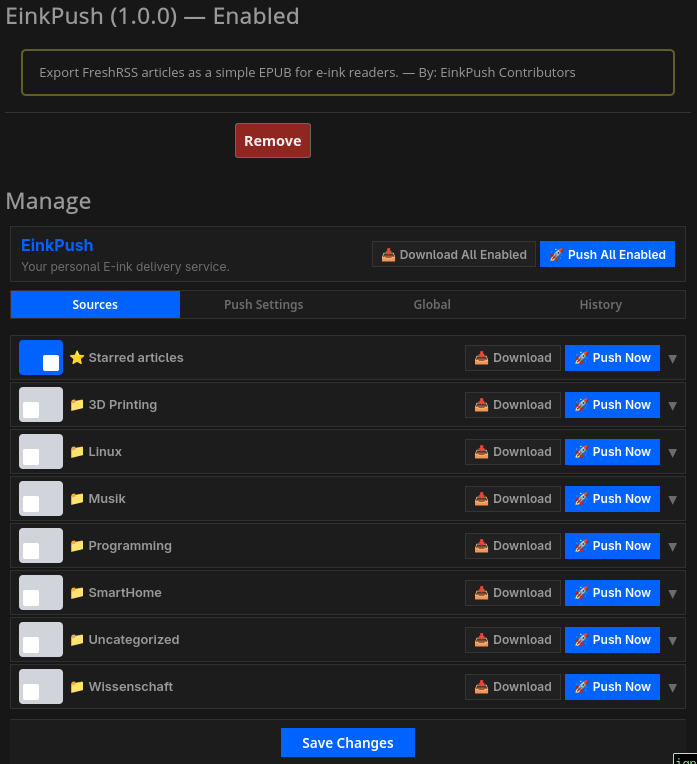
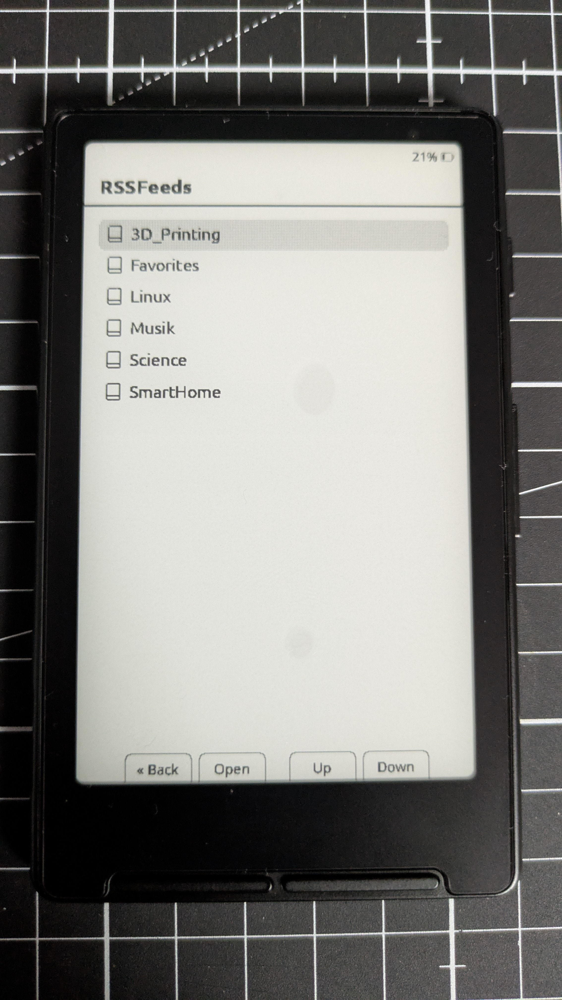

# 📱 EinkPush

**Your personal E-ink delivery service for FreshRSS.**

EinkPush turns your FreshRSS feeds into beautifully formatted EPUB files, optimized specifically for e-ink readers. Whether you want to download them manually or have them automatically pushed to your device, EinkPush makes reading your news a distraction-free experience.

## ✨ Key Features

*   **Smart Content Selection**: Export specific categories or your starred "Favorites".
*   **Automatic Delivery**: Schedule cron jobs to automatically push new content to your device via a simple HTTP endpoint.
*   **Device-Specific Optimization**: Custom screen dimensions and font scaling ensure your EPUBs look perfect on any e-reader.
*   **Full-Text Extraction**: Optional Readability API integration to fetch full article content for truncated feeds.
*   **Native Integration**: A clean, orange "EinkPush" button fits right into your FreshRSS sidebar.
*   **Multi-File Downloads**: Download all your enabled sources at once with a single click.

## 📸 In Action

  
  
  

## 🚀 Quick Start

1.  **Install**: Clone this repo into your FreshRSS `extensions/` folder as `xExtension-EinkPush`.
2.  **Enable**: Go to *Settings > Extensions* in FreshRSS and enable **EinkPush**.
3.  **Configure**: Click the **📱 EinkPush** button in your sidebar to set your screen size and select your content.
4.  **Read**: Download your EPUBs or set up an endpoint for automatic delivery.

---
*Vibe-coded with AI. Built to solve a daily reading workflow.*
