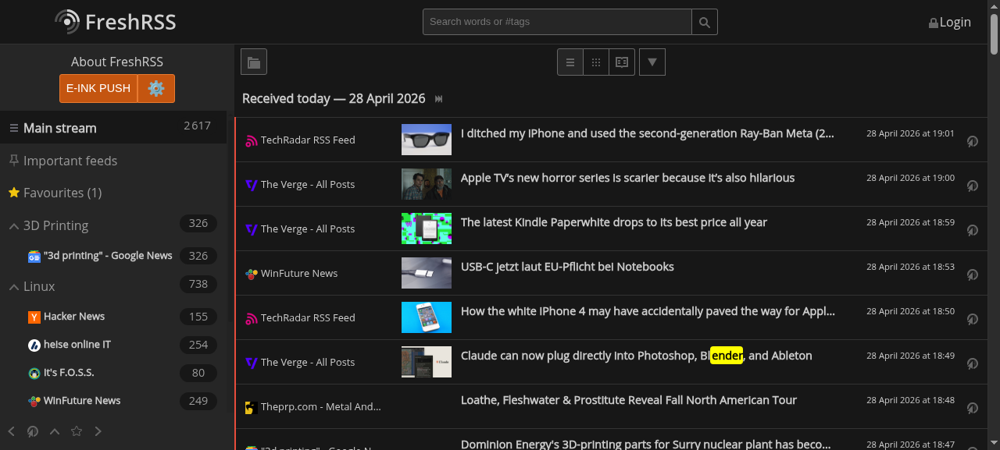
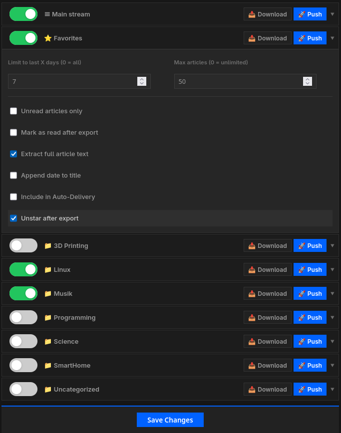
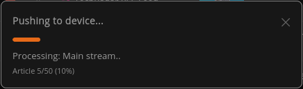

# 📱 EinkPush

**FreshRSS to E-ink EPUB pusher.**

Export feeds to EPUB, download or push to your e-ink reader.

## Features

- **Per-source Push & Download**: Any category, main stream, favorites
- **Auto-Push**: Schedule pings, smart cooldown, live status countdown
- **Readability Integration**: Full-text extraction via API
- **Real-time Progress**: Live progress modal during push/download
- **Native UI**: Sidebar button matches FreshRSS style exactly

## Screenshots

  
  
  

## Install

1. Clone into `extensions/xExtension-EinkPush`
2. Enable in *Settings > Extensions*
3. Click ⚙️ sidebar button to configure
4. Push or download

---
*Vibe-coded with AI.*
